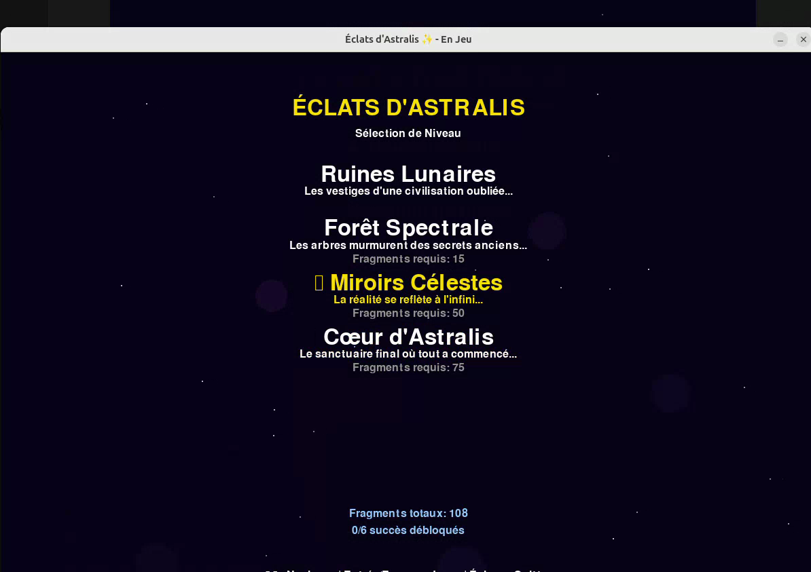
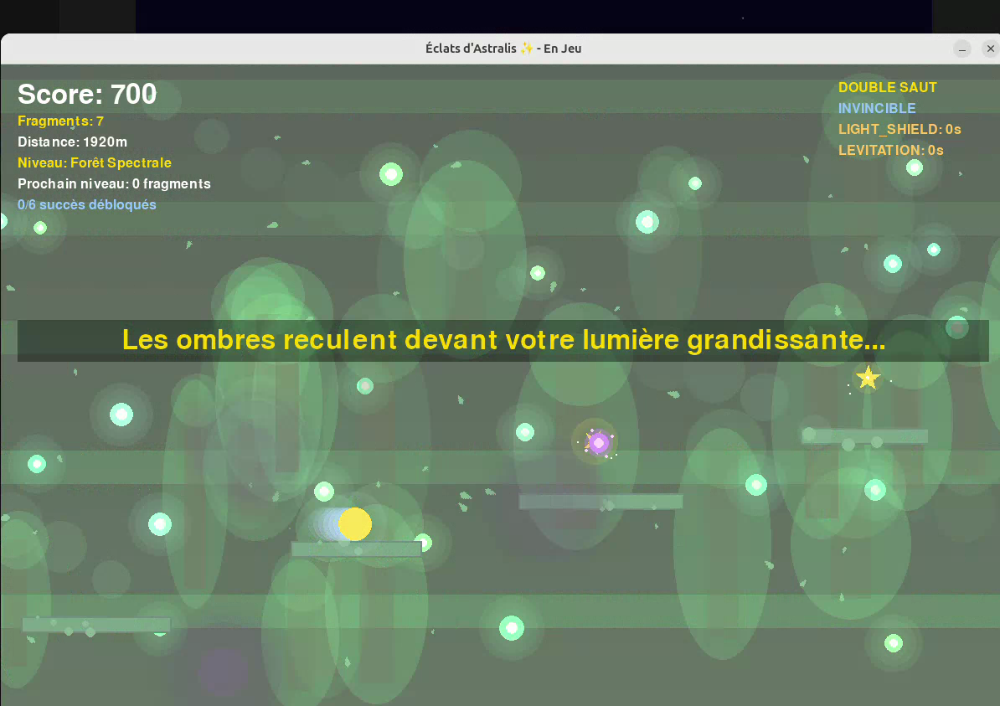
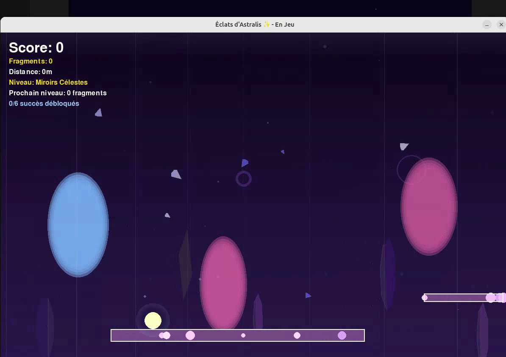
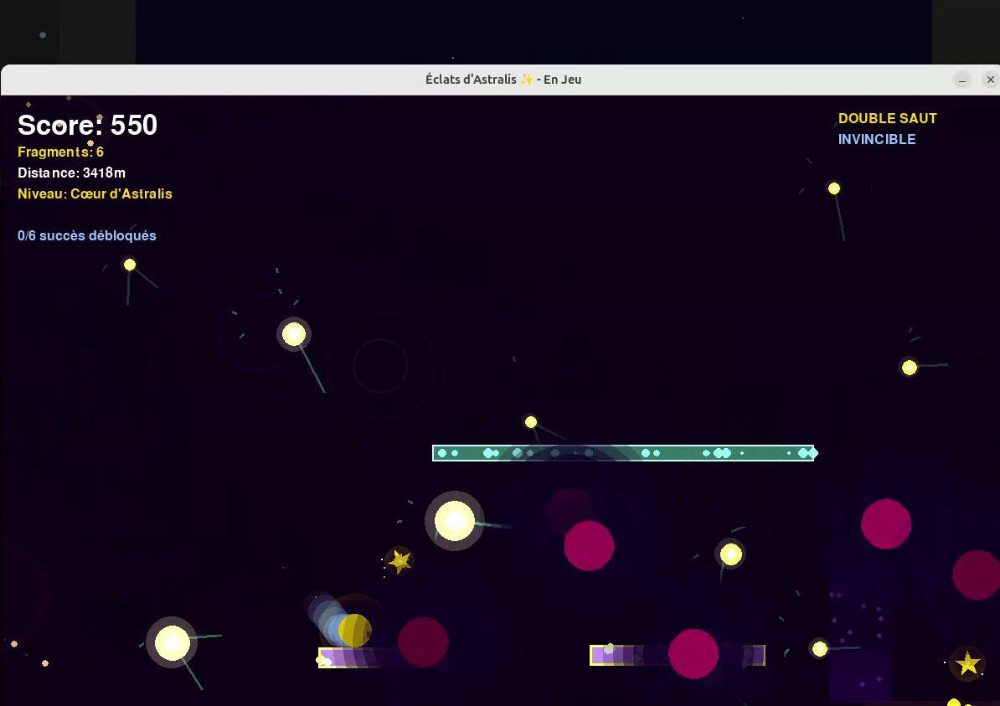
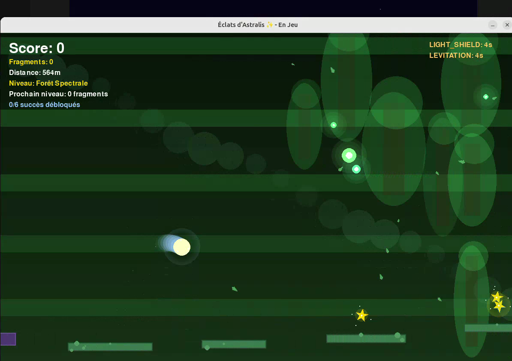
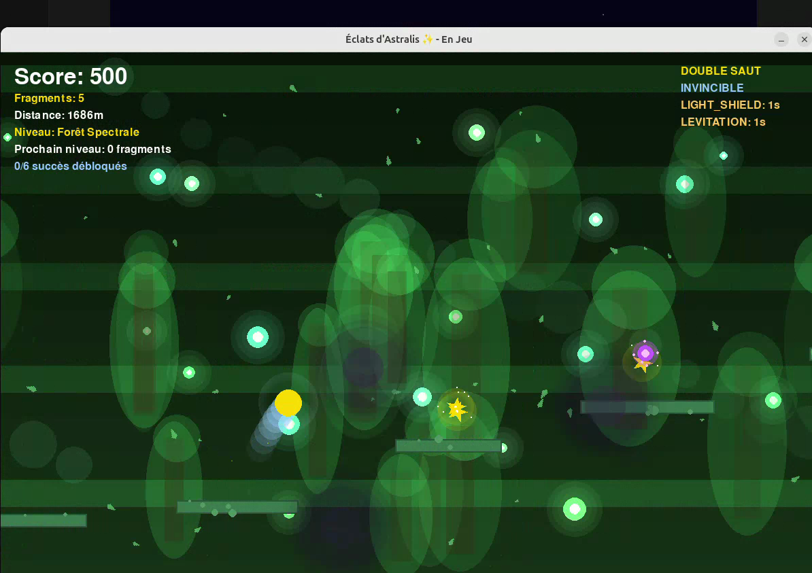
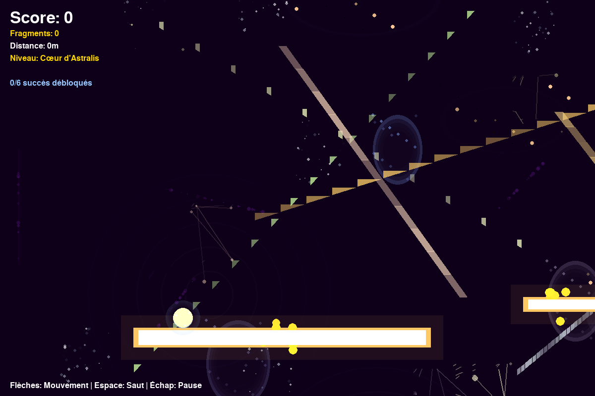

# 🌟 Éclats d'Astralis ✨

**Un voyage mystique à travers les royaumes stellaires**



---

## 🎮 À Propos du Jeu

**Éclats d'Astralis** est un jeu de plateforme mystique où vous incarnez **Lyra**, un esprit lumineux en quête des fragments d'étoiles perdus. Traversez des royaumes enchantés, maîtrisez le double saut et collectez les précieux cristaux pour restaurer l'équilibre cosmique.



### ✨ Fonctionnalités

- 🌍 **4 Royaumes Uniques** : Ruines Lunaires, Forêt Spectrale, Miroirs Célestes, Cœur d'Astralis
- 🦘 **Contrôles Fluides** : Mouvement précis avec double saut magistral
- ⭐ **Collecte de Fragments** : Trouvez tous les cristaux pour débloquer de nouveaux niveaux
- 🎨 **Effets Visuels** : Particules magiques et auras lumineuses
- 🏆 **Système de Succès** : Défis et accomplissements à débloquer
- 💾 **Sauvegarde Automatique** : Votre progression est toujours conservée



---

## 🚀 Installation Rapide

### Prérequis
- Python 3.8+ 
- Pygame 2.0+

### Lancement
```bash
# Cloner le repository
git clone https://github.com/Courouge/Lyra.git
cd Lyra

# Installer les dépendances
pip install pygame

# Lancer le jeu
python main.py
```

### Script de Lancement Automatique
```bash
chmod +x run_game.sh
./run_game.sh
```

---

## 🎯 Comment Jouer

### Contrôles
- **←→** ou **A/D** : Déplacement latéral
- **Espace** ou **↑** ou **W** : Saut
- **Espace** (en l'air) : Double saut
- **Échap** : Menu pause
- **Enter** : Confirmer les sélections

### Objectifs
1. 🌟 **Collectez les fragments d'étoiles** dispersés dans chaque niveau
2. 🚪 **Atteignez la sortie** pour progresser vers le royaume suivant  
3. 🏆 **Déverrouillez tous les succès** en relevant les défis optionnels
4. ⚡ **Maîtrisez les mécaniques avancées** pour des scores parfaits



---

## 🌍 Les Quatre Royaumes

### 1. 🌙 Ruines Lunaires
- **Difficulté** : ⭐ Débutant
- **Fragments requis** : 0 (niveau de départ)
- **Spécialités** : Introduction aux mécaniques de base

### 2. 🌲 Forêt Spectrale  
- **Difficulté** : ⭐⭐ Intermédiaire
- **Fragments requis** : 25
- **Spécialités** : Plateformes mobiles et passages secrets

### 3. 🪞 Miroirs Célestes
- **Difficulté** : ⭐⭐⭐ Avancé
- **Fragments requis** : 50
- **Spécialités** : Portails mystiques et gravité inversée

### 4. ⭐ Cœur d'Astralis
- **Difficulté** : ⭐⭐⭐⭐ Expert
- **Fragments requis** : 75
- **Spécialités** : Défi final avec vortex cosmique

---

## 🏆 Système de Succès

Débloquez des accomplissements uniques :

- **🎯 Atterrissage Parfait** : 10 atterrissages parfaits consécutifs
- **👻 Maître des Ombres** : Terminer un niveau sans toucher d'ombre
- **💎 Collectionneur Parfait** : 100% des fragments dans un niveau
- **⚡ Coureur Astral** : Niveau terminé en moins de 2 minutes
- **🗺️ Explorateur Mystique** : 5 zones secrètes découvertes
- **🦘 Maître des Combos** : 20 sauts consécutifs sans toucher le sol

---

## 🎨 Captures d'Écran

<table>
<tr>
<td></td>
<td></td>
</tr>
<tr>
<td align="center"><i>Exploration des ruines mystiques</i></td>
<td align="center"><i>Niveaux avancés avec défis</i></td>
</tr>
</table>

---

## 🔧 Développement

### Architecture
```
📁 Lyra/
├── 🎮 main.py              # Point d'entrée principal
├── 🎯 game.py              # Logique principale du jeu
├── 🎨 settings.py          # Configuration et constantes
├── 📁 entities/            # Joueur, ennemis, objets
├── 📁 levels/              # Générateurs et gestionnaires de niveaux
├── 📁 menu/                # Système de menus
├── 📁 systems/             # Sauvegarde, succès, son
└── 📁 assets/              # Images, sons, données
```

### Technologies
- **Langage** : Python 3.8+
- **Framework** : Pygame 2.0+
- **Format de sauvegarde** : JSON
- **Compatibilité** : Multi-plateforme (Windows, macOS, Linux)

---

## 🤝 Contribution

Les contributions sont les bienvenues ! Pour contribuer :

1. 🍴 Fork le projet
2. 🌱 Créez votre branche feature (`git checkout -b feature/AmazingFeature`)
3. 💾 Commit vos changements (`git commit -m 'Add some AmazingFeature'`)
4. 📤 Push vers la branche (`git push origin feature/AmazingFeature`)
5. 🔄 Ouvrez une Pull Request

### Idées de Contributions
- 🎵 Système audio (musique et effets sonores)
- 🌐 Traductions multilingues
- 🎮 Contrôleur gamepad
- 📱 Optimisations mobile
- 🎨 Nouveaux assets visuels

---

## 📜 Licence

Ce projet est sous licence MIT. Voir le fichier `LICENSE` pour plus de détails.

---

## 🎊 Crédits

- **Développement** : Collaboration IA-Humain
- **Framework** : Pygame Community
- **Inspiration** : Jeux de plateforme classiques

---

## 📞 Support

Rencontrez un problème ? Plusieurs options :

- 📝 [Ouvrir une issue](https://github.com/votre-username/Lyra/issues)

---

<div align="center">

**🌟 Éclats d'Astralis - Où la magie rencontre le code ✨**



*Embarquez dans cette aventure mystique et redécouvrez la magie du gaming indépendant !*

[](https://python.org)
[](https://pygame.org)
[](https://opensource.org/licenses/MIT)
[](https://github.com/ellerbrock/open-source-badges/)

</div> 